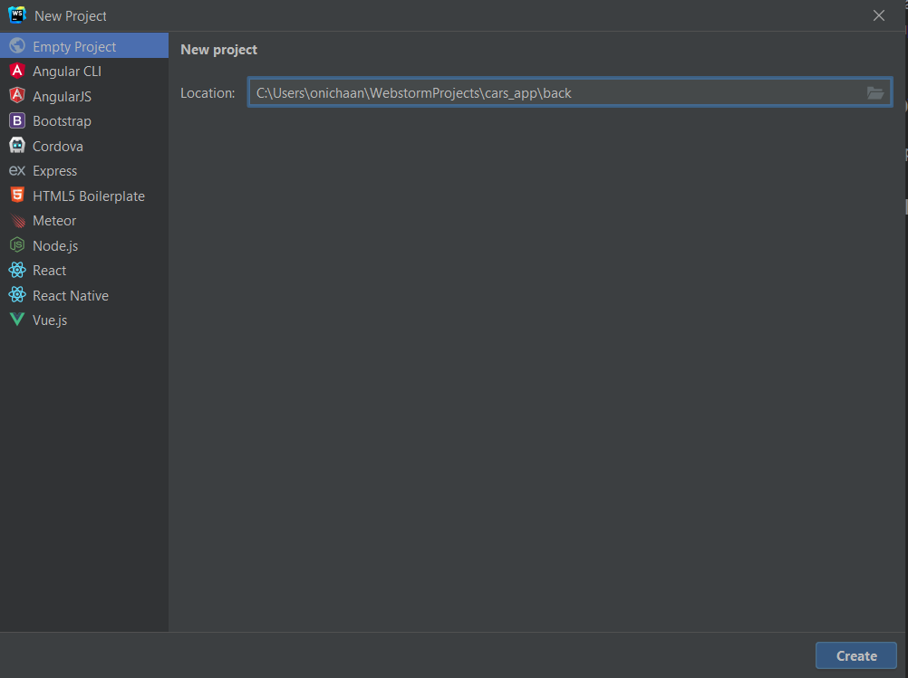
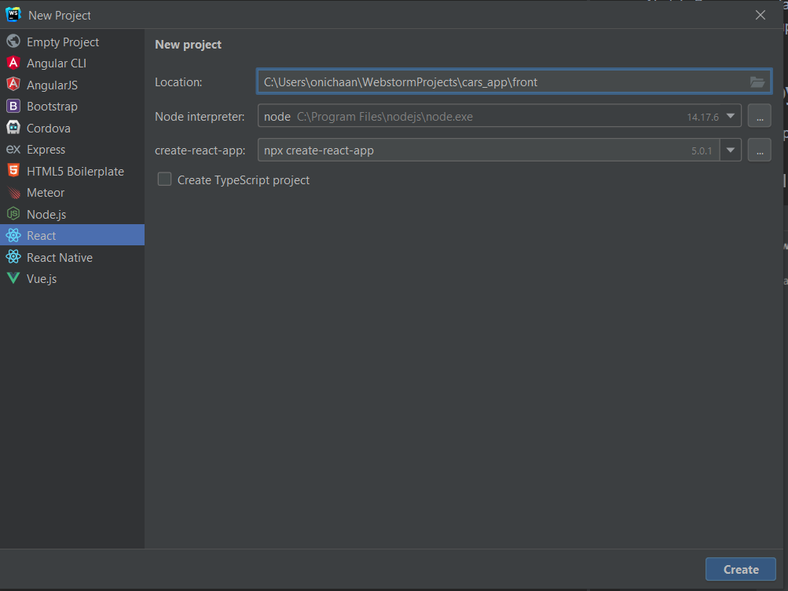

# Команда запуска всего приложения: "docker-compose up --build"
## Подготовка к участию в уроке
 * Вам понадобится одна из IDE https://www.jetbrains.com/ru-ru/webstorm/download или https://visualstudio.microsoft.com/ru/ все примеры будут показанны в Webstorm
 * Nodejs Для запуска Javascript https://nodejs.org/en/
 * Docker, для запуска приложения целиком https://www.docker.com/get-started/

## Создание структуры проекта
Создадим общую папку проекта C:\Users\ваш пользователь\WebstormProjects\cars_app
В IDE File->New Project
### Создание BackEnd проекта

#### Настройка Бэкэнд проекта
1.Переносим knexfile.js
2.Наполняем файл package.json
```json
"scripts": {
    "start": "node index.js",
    "dev": "NODE_ENV=development nodemon index.js",
    "migrations:up": "knex migrate:latest",
    "migrations:down": "knex migrate:down",
    "seed": "knex seed:run"
  },

start - команда запускает наш проект
dev - команда запускает наш проект, автоматически перезапускает сервер, при изменении кода
migrations:up - команда обновляет базу данных
migrations:down - команда сбрасывает наши изменения в базе данных
see - команда наполняет базу данных нашими изначальными данными

"dependencies": {
    "@fastify/cors": "^7.0.0",
    "dotenv": "^16.0.0",
    "fastify": "^3.27.1",
    "fastify-file-upload": "4.0.0",
    "knex": "^1.0.3",
    "pg": "^8.7.3"
    },
"devDependencies": {
    "nodemon": "^2.0.16"
}
```
### Создание FrontEnd проекта

1. Удаляем файлы сгенерированные по умолчанию
2. Наполняем package.json зависимостями.
```
"normalize.css": "^8.0.1",
"styled-components": "^5.3.3",
"axios": "^0.26.0",
```
3. В терминале выполняем команду npm install -D tailwindcss postcss autoprefixer
4. В терминале выполняем команду npx tailwindcss init -p
5. В файл tailwind.config.js. В массив content добавляем "./src/**/*.{js,jsx,ts,tsx}",
6. Создаем директорию styles
7. Скачиваем стили с сайта https://fonts.google.com/specimen/Poppins
8. Создаем файл fonts.css  в директории стайлес
9. В него подключаем стили шрифтов
10. Подключаем его в index.js import './styles/fonts.css';
11. Создаем файл index.css. в него прописываем
```
@tailwind base;
@tailwind components;
@tailwind utilities;
```
12. Подключаем его в index.js import './styles/index.css';
13. Создаем App.js Файл
14. Создаем папку Blocks в папке src

### Настройка глобальной части проекта

1. Открываем в IDE папку cars_app, в ней содержаться две папки front и back
2. Переносим папку conf, Настройки файлового сервера, этот сервер будет обрабатывать все запросы к приложению, отдавать файлы фронтэнда, картинки и делегировать запросы к нашему приложению с логикой
3. .env. Это файл с настройками окружения, здесь хранятся настройки базы данных и приложения. Это самая секретная информация приложения!
4. Переносим docker-compose, Dockerfile.prod, Dockerfile.back. Это инструкции, как запускать наше приложение. Для запуска стольких сущностей необходимо выполнять множество команд. эти файлы позволяют нам описывать инфраструктуру как код и запускать простой командой все приложение.
5. Переносим файл .dockerignore он помагает нам не компировать в сборки файлы, которые нужны нам для локальной разработки или вспомогателньые файлы
6. Переносим .gitignore позволяет нам не уносить в репозиторий файлы которые являются локальными и нужными для остальных участников разработки

Все готово, вы можете начать написание кода

## Ссылки на информацию в проекте
* Объекты https://learn.javascript.ru/object
* Функции https://learn.javascript.ru/function-basics
* Стрелочные функции https://learn.javascript.ru/arrow-functions-basics
* CSS https://developer.mozilla.org/ru/docs/Learn/Getting_started_with_the_web/CSS_basics
## Продвинутая теория
* Введение в функциональное программирование https://habr.com/ru/post/154105/
* Работа с Объектами https://developer.mozilla.org/ru/docs/Web/JavaScript/Guide/Working_with_Objects
* Асинхронность JS https://developer.mozilla.org/ru/docs/Learn/JavaScript/Asynchronous
* SQL https://htmlacademy.ru/tutorial/php/sql